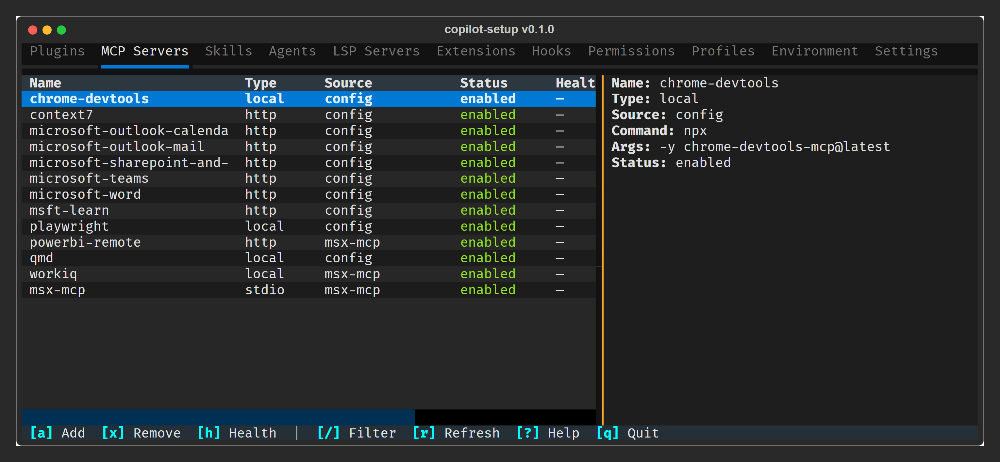

# copilot-setup

A read-only Textual TUI dashboard for GitHub Copilot CLI. Shows you exactly what's
configured — MCP servers, plugins, skills, agents, settings, and more — without
modifying anything.



## Installation

```bash
pip install copilot-setup
```

Requires Python ≥ 3.11.

## Usage

```bash
copilot-setup           # Launch the TUI dashboard
copilot-setup doctor    # Probe MCP server health
```

**11 tabs** · **Instant filter** (`/`) · **Detail pane** · **Plugin management** · **Doctor health probes**

📖 **[Full documentation →](https://ericchansen.github.io/copilot-setup/)**
